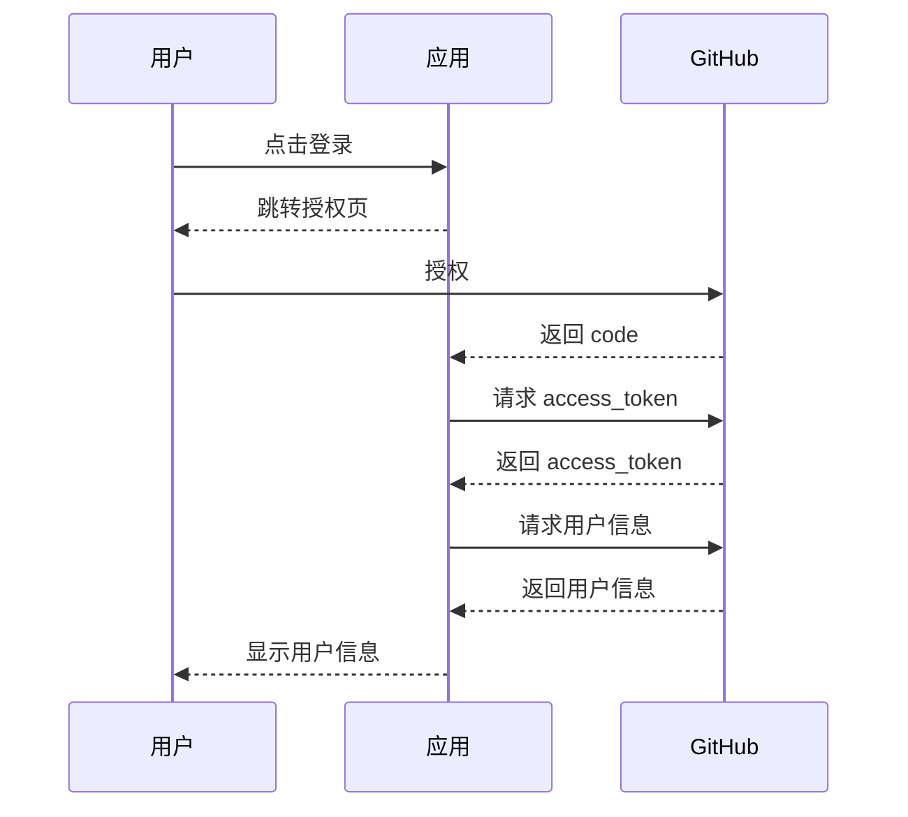

# GitHub OAuth 第三方登录流程

## 核心流程

1. **用户授权**：用户点击“GitHub 登录”，跳转授权页面，授权后回调返回 `code`。
2. **获取令牌**：用 `code`、`client_id`、`client_secret` 换取 `access_token`。
3. **获取信息**：用 `access_token` 获取用户信息（用户名、头像等）。

## 流程图

## 关键端点

- 授权：`https://github.com/login/oauth/authorize`
- 令牌：`https://github.com/login/oauth/access_token`
- 用户信息：`https://api.github.com/user`

## 配置

1. 在 [GitHub Developer Settings](https://github.com/settings/developers) 创建应用，获取 `client_id` 和 `client_secret`。
2. 设置回调地址（如 `http://localhost:8080/oauth/redirect`）。

## 注意事项

- 添加 HTTPS 和 CSRF 防护。
- 处理令牌过期和 API 限制。
